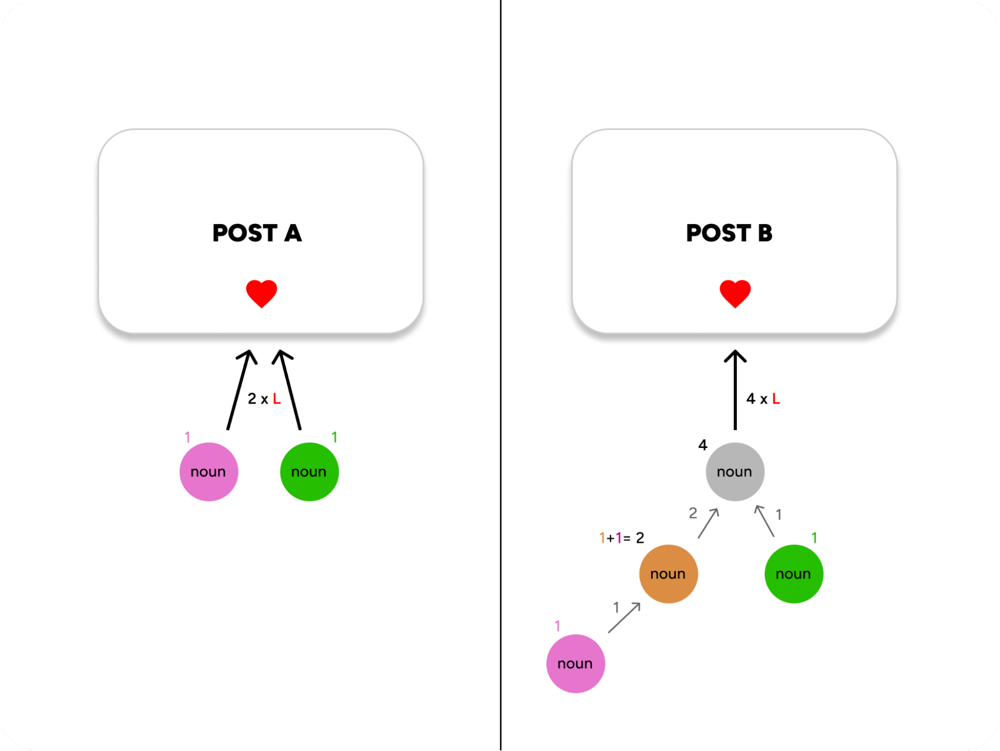

# Exhibit A: NounRank

## Overview

To briefly explain the figure first, Post A has 2 likes. Post B has 1 like. But Post B is ranked higher.

## The Algo

Inspired by Page Rank, to summarise: “PageRank works by counting the number and quality of outbound links to a page to determine a rough estimate of how important the website is.”

Similarly, Noun Rank treats an “outbound link” as a “vote” of sorts. In terms of the Farcaster protocol, this “outbound link” is a “follow”:

- Every Noun NFT owner has a score. To simplify things, let's say each Noun has a score of one (1).
- When another follows a Noun, they inherit their score. In this way, the most followed Noun has the highest score and quality.

This system can work with any trait to increase an individual Noun's score. The sum would represent the overall “Nounishness” – e.g., ‘How long have they owned a Noun?’ ‘How active they are in the community?’ ‘How many Nouns do they own?’—with different assigned scores for each trait.

The sum (overall score) of a Noun will impact which posts are deemed essential. Different actions (comment, like, or repost) have a distinct ‘weight’—in the figure, L represents the weight for likes.

Instinctively, a Repost would have the highest weight (e.g., 3), a Comment could weigh 2.5, and a Like could weigh 2. 

### Scenarios

To illustrate, let’s explore different scenarios for Post B:
- Noun (score of 4) likes (weight of 2); post’s score = 8.
- Noun (score of 4) leaves a comment (weight of 2.5); post’s score = 10.
- Noun (score of 4) leaves a comment (weight of 2.5), and likes (weight of 2); post’s score = 20.

Compare the above scenario with one from Post A:
- Post A—The 2 Nouns (combined score of 2), comment (weight of 2.5), and like (weight of 2); the post’s score = 10.
- Post B—Noun (score of 4) leaves a comment (weight of 2.5) and likes (weight of 2), which equals the post’s score of 20.

The sum (overall score) of a Noun will impact which posts are deemed essential. This satisfies our goal of “Nounishness.” We could include as many ‘traits’ as possible (given the time) to the algo. The score of a Noun/user’s posts could also act as a ‘trait’ (it matters if your posts are high quality or low quality).

## Addendum

### Possible Traits and Scores (demonstrative purposes only, numbers and weights are subject to change in a live environment).

- Owning a Noun (already covered): 1
- Owning 1+ Nouns*: Sqrt(Nouns Owned)
- In the community for less than 3 months: 1.5
- In the community for 3 months+: 2
- In the community for 12 months+: 3
- OGs (first 6 months): 5
- Total accumulated post-score: Post Score/10

*Introduced a “Quadratic Cost” (the cost of owning more than one Noun increases quadratically, not linearly):
- Owning 1 Noun adds 1 to your score (sqrt(1) = 1).
- Owning 9 Nouns adds 3 to your score (sqrt(9) = 3).
- Owning 100 Nouns adds 10 to your score (sqrt(100) = 10).
